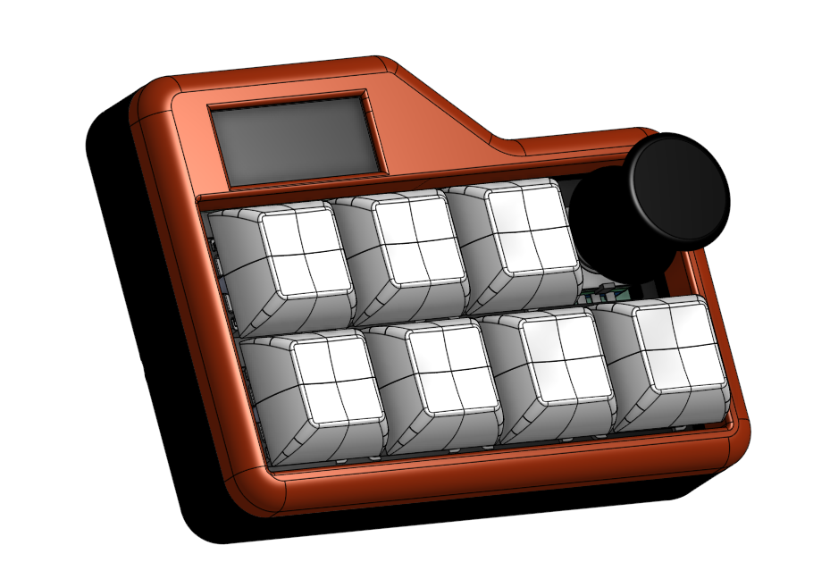

# SamiPad Macropad

A 7-key macropad with a rotary encoder and 0.91" OLED, built on the Seeed XIAO RP2040.

* Keyboard Maintainer: [Samrath "Sami" Singh (@Sami9889)](https://github.com/Sami9889)
* Website: [sami-s.dev](https://sami-s.dev)
* Hardware Supported: Seeed XIAO RP2040, 7x MX switches, EC11 rotary encoder, SSD1306 0.91" I2C OLED
* Hardware Availability: [github.com/Sami9889/Macro-pad](https://github.com/Sami9889/Macro-pad)

## Compiling

Make example for this keyboard (after setting up your QMK build environment):

    qmk compile -kb sami/macropad -km default

Flashing example for this keyboard:

    qmk flash -kb sami/macropad -km default

See the [build environment setup](https://docs.qmk.fm/#/getting_started_build_tools) and the [make instructions](https://docs.qmk.fm/#/getting_started_make_guide) for more information.

## Bootloader

Enter the bootloader by:

* **Bootmagic reset**: Hold down the top-left key while plugging in the board.
* **Physical reset**: Double-tap the reset/boot button on the XIAO RP2040, then drag the `.uf2` onto the `RPI-RP2` drive.
