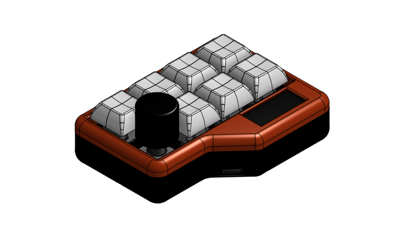
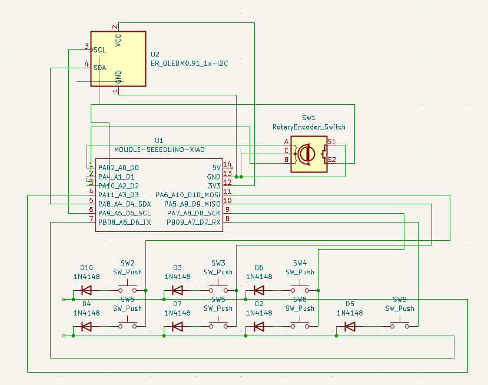
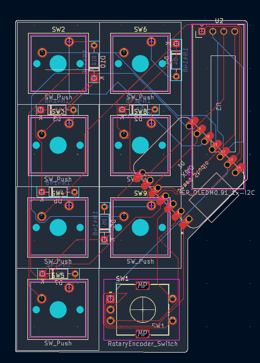

# SamiPad

A clean, minimal, handy macropad by **Samrath "Sami" Singh** for times when 104 keys aren't enough 

*(or just an easier way to copy and paste)* 

---

## Quick Start

1. Hold **BOOT** and plug in your XIAO RP2040.
2. Drop `sami_macropad_default.uf2` onto the `RPI-RP2` drive.
3. Plug it back in. Watch **Samrath "Sami" Singh** scroll across the OLED.

---

## Features

- **OLED display** with an animated **Samrath "Sami" Singh** name banner (plus room for custom info)
- **Rotary encoder and button** for volume adjustment, scrolling, or whatever you want to map it to!
- **7 keys** to map to the shortcuts you desire

---

## Defaults (if you don't want to change anything):

### Keys:

| Row        | Key 1           | Key 2           | Key 3         | Key 4        |
|------------|-----------------|-----------------|---------------|--------------|
| **Top**    | Play/Pause      | Previous Track  | Next Track    | Rotary Encoder In This Spot|
| **Bottom** | Copy (Ctrl+C)   | Paste (Ctrl+V)  | Undo (Ctrl+Z) | Print Screen |

### Encoder:

- **Rotate left** → Volume Down
- **Rotate right** → Volume Up
- **Push** → Mute

---

## What is this?

This is a macropad I made, built to assist me at my desk. This device can come in handy whether you're designing something in CAD, working on a PCB, gaming, or really anything you would like to use it for.

## How it works and Issues I Faced

The Xiao RP2040 is mounted on the bottom of the PCB along with the diodes. The rest of the components are on the top. The macropad is running **QMK** for the keymaps, screen, and knob. Pretty obvious, but it uses a matrix layout for the switches. 

When I was designing the PCB I wanted to make this macropad as compact as possible with its current hardware which was challenging. I had to reposition the components several times before I was satisfied. I also spent quite some time in CAD designing this case as I wanted to make it as clean as possible. It took me quite some while to find the right shape and size without making it look awkward.

---

## BOM

- 1x unsoldered Seeed XIAO RP2040
- 7x through-hole 1N4148 Diodes
- 7x MX-Style switches
- 1x EC11 Rotary encoder
- 1x 0.91 inch OLED display *(the pin order is GND-VCC-SCL-SDA, **MAKE SURE YOUR PCB MATCHES**)*
- 7x white blank DSA keycaps
- 6x M3x16mm screws

---

## Renders

---

## Schematic

---

## PCB Layout

---

## Author

**Samrath "Sami" Singh**

- GitHub: [@Sami9889](https://github.com/Sami9889)
- Website: [sami-s.dev](https://sami-s.dev)

---

## Credits

Big shout out to **Hack Club** and the **Hackpad** program for giving me the opportunity to make this macropad.

---

## Disclaimer

This project is open source. If anything you make out of this does not work or has any issues, I sincerely apologize, but at the end of the day **that's on you.**
